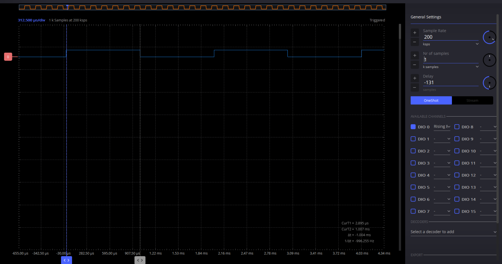
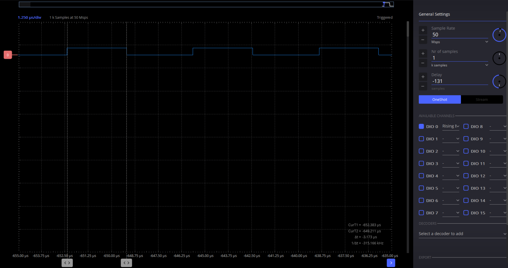
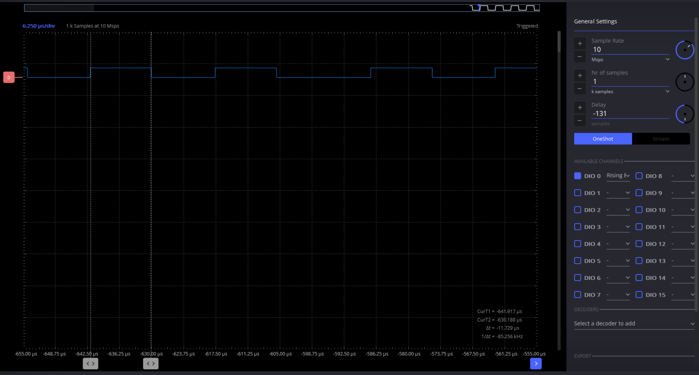

# Project 3: Measuring minimum delay in Arduino using the ADALM2000 logic analyzer

1. Understand the use of variables in code
2. Learn how to use a logic analyzer
3. Understand the concept of overhead and measure it

## resources
[Arduino Functions Reference](https://www.arduino.cc/reference/en/)

## Change Blink.ino code
 - Save Blink example as BlinkWithVariableDelay.ino in this folder
 - Use a variable to change built in led (13) to grove led (4)
 - Use a variable to change delay to 1 ms 
 - upload to arduino
 - can you see the led blink? Why?
   No. Because our eyes cannot percieve the changes with such fast changes.

## Use logic analyzer to see and measure the blink
 - connect ADALM2000 to grove kit: 
    - gnd in ADALM to GND in arduino (black color is used as a standard for GND)
    - digital pin 0 (solid pink) to pin13 in arduino (why?)
 - open scopy program
 - connect to ADALM2000
 - open scopy logic analyzer
 - activate DIO0 and rising edge and run (why?)
 - play with the scopy parameters until you can see the separate blinks. Which parameter(s) do you need to change?
      We need to view a long enough window. Either increase number of samples or decrease samples rate.
 - use cursors and sample rate to measure the pulse width
 - take screenshots and add them to the README below.
 

## Measure overhead
 - Remove the delay statements and upload the code
 - Measure pulse width. What is the minimum time that the signal is HIGH and LOW? this is the overhead.
      Around 3.17 microseconds.
 - Take screenshots and add them to the README below.
 

## even shorter blink
- delay() is limited to 1 ms. Find a function that delays 1 microsecond. 
      delayMicroseconds
 - Try different delays and measure the overhead.
      For delay of 10 microseconds, we get overhead of 1.91 microseconds.
      For delay of 1 microsecondm, we get overhead of 2 microseconds.
 - Take screenshots and add them to the README below.

## Git
 - Commit the new README with your screenshots
 - push to your repo.

## Exercise

